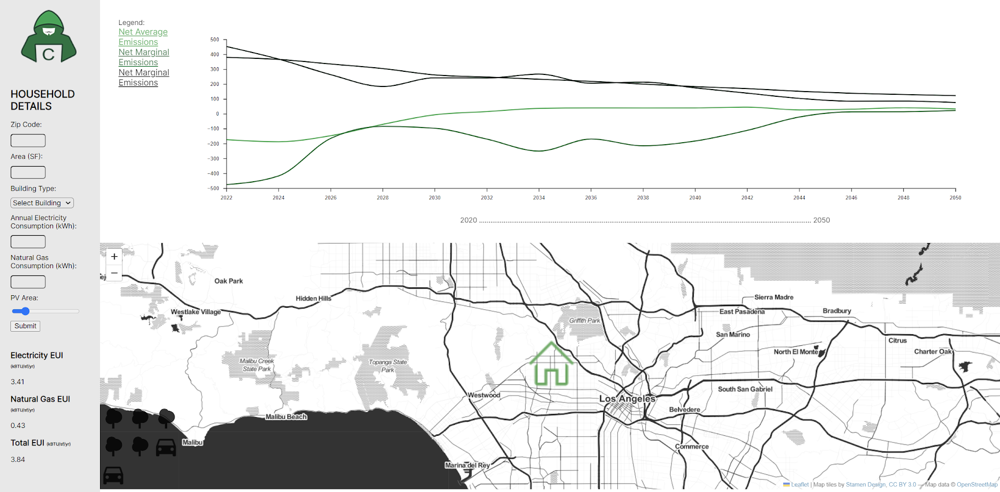
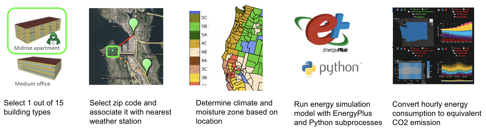

# Carbon Hacker: Operational Carbon Calculator

Carbon Hacker is a web tool for home/building owners and designers to understand the current and future operational carbon
emissions of their existing or proposed buildings due to their grid electricity and on-site fossil fuel usage, as well as the
impact of PV on the net emissions.

The only inputs required are a zip code, building type, building area, and annual electricity/gas consumption, the last of
which home/building owners can get from their utility bills.
The tool shows both the conventional average carbon emissions as well as [marginal emissions](https://lmnarchitects.com/lmn-research/13-operational-carbon-design-process),
the latter of which is an important metric for building designers.

This tool goes beyond other operational carbon emission calculators by providing a simple interface for homeowners, providing
emissions from now through the next 30 years as the electricity grid changes, including marginal emissions in addition to
average emissions for designers, and using a more accurate hourly energy and grid emission analysis that captures
important time-based correlations between the grid generation mix (e.g. clean PV vs. dirty natural gas plants) and the
building energy consumption.

This project was part of the [2023 AECtech Hackathon in Seattle](https://www.aectech.us/seattle-hackathon).  It is open-source
and relies entirely on other open-source tools and datasets.

### Team Members
- Sishe Jeff Chin
- Margarita Ganeva
- Heinrich Hoza
- Daniel Mayall
- Pawel Sapiecha
- Chris Savage
- Fendy Setiawan
- Chuou Zhang

## Screenshot

## Framework

The tool contains a python backend and javascript frontend.  From the user's zip code and building typology (e.g. single-family
residential), the backend locates the nearest reference building data from a database containing precalculated electricity and
grid carbon emissions for a variety of building typologies and locations across the U.S. The frontend post-processes the reference
data to scale it to the user's provided building area and energy usage, then provides an interactive visualization using the
open-source [D3.js](https://d3js.org/) and [Leaflet](https://leafletjs.com/) libraries. 

The database is generated using the state-of-the-art open-source [EnergyPlus energy modeling software](https://energyplus.net/),
publicly-available [DOE/PNNL prototype building models](https://www.energycodes.gov/prototype-building-models),
publicly-available [OneBuilding.org weather files](https://climate.onebuilding.org/),
and the publicaly-available [NREL Cambium grid carbon emissions data](https://scenarioviewer.nrel.gov/)
(Cambium provides localized, hourly grid carbon emissions from now through 2050).
The [pvlib python library](https://pvpmc.sandia.gov/applications/pv_lib-toolbox/) can be used to generate hourly PV data,
but incorporation of this tool was not complete as of completion of the Hackathon.
The energy modeling, grid emissions, and PV data are all done on a local, weather-based, hourly basis and thus captures
important time-based correlations between the grid generation mix (e.g. clean PV vs. dirty natural gas plants) and the
building energy consumption.

The repo contains python scripts to build the reference building database by running the appropriate prototype building
energy models at each available weather station, then combining hourly energy data with corresponding hourly grid emissions
data.

## Usage

**TBD.**
